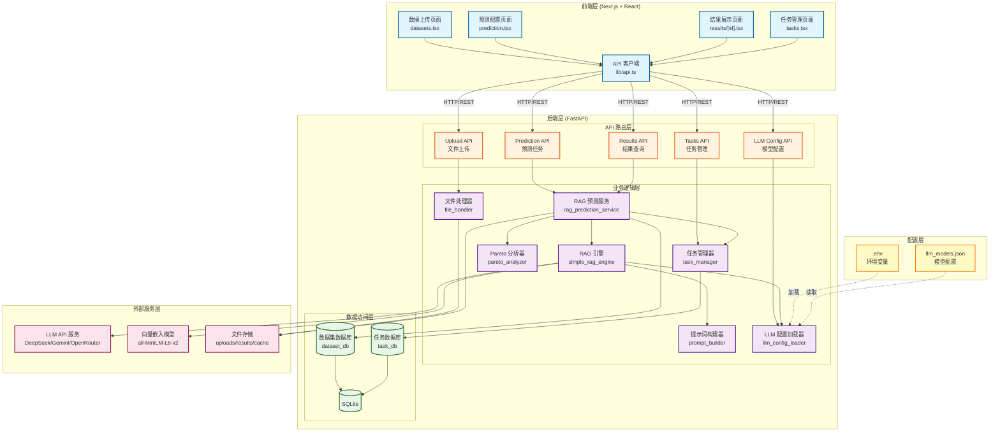

```mermaid  
graph TB
    subgraph Frontend["前端层 (Next.js + React)"]
        UI1[数据上传页面<br/>datasets.tsx]
        UI2[预测配置页面<br/>prediction.tsx]
        UI3["结果展示页面<br/>results/[id].tsx"]
        UI4[任务管理页面<br/>tasks.tsx]
        
        API_CLIENT[API 客户端<br/>lib/api.ts]
        
        UI1 --> API_CLIENT
        UI2 --> API_CLIENT
        UI3 --> API_CLIENT
        UI4 --> API_CLIENT
    end
    
    subgraph Backend["后端层 (FastAPI)"]
        subgraph API_Routes["API 路由层"]
            UPLOAD_API[Upload API<br/>文件上传]
            PRED_API[Prediction API<br/>预测任务]
            RESULT_API[Results API<br/>结果查询]
            TASK_API[Tasks API<br/>任务管理]
            LLM_API[LLM Config API<br/>模型配置]
        end
        
        subgraph Services["业务逻辑层"]
            RAG_SERVICE[RAG 预测服务<br/>rag_prediction_service]
            RAG_ENGINE[RAG 引擎<br/>simple_rag_engine]
            TASK_MGR[任务管理器<br/>task_manager]
            PARETO[Pareto 分析器<br/>pareto_analyzer]
            PROMPT[提示词构建器<br/>prompt_builder]
            LLM_LOADER[LLM 配置加载器<br/>llm_config_loader]
            FILE_HANDLER[文件处理器<br/>file_handler]
        end
        
        subgraph Database["数据访问层"]
            DATASET_DB[(数据集数据库<br/>dataset_db)]
            TASK_DB[(任务数据库<br/>task_db)]
            SQLITE[(SQLite)]
        end
    end
    
    subgraph External["外部服务层"]
        LLM_SERVICES[LLM API 服务<br/>DeepSeek/Gemini/OpenRouter]
        EMBED_MODEL[向量嵌入模型<br/>all-MiniLM-L6-v2]
        FILE_STORAGE[文件存储<br/>uploads/results/cache]
    end
    
    subgraph Config["配置层"]
        ENV_FILE[.env<br/>环境变量]
        LLM_CONFIG[llm_models.json<br/>模型配置]
    end
    
    %% Frontend to Backend
    API_CLIENT -->|HTTP/REST| UPLOAD_API
    API_CLIENT -->|HTTP/REST| PRED_API
    API_CLIENT -->|HTTP/REST| RESULT_API
    API_CLIENT -->|HTTP/REST| TASK_API
    API_CLIENT -->|HTTP/REST| LLM_API
    
    %% API Routes to Services
    UPLOAD_API --> FILE_HANDLER
    PRED_API --> RAG_SERVICE
    RESULT_API --> RAG_SERVICE
    TASK_API --> TASK_MGR
    LLM_API --> LLM_LOADER
    
    %% Services Interactions
    RAG_SERVICE --> RAG_ENGINE
    RAG_SERVICE --> TASK_MGR
    RAG_SERVICE --> PARETO
    RAG_ENGINE --> PROMPT
    RAG_ENGINE --> LLM_LOADER
    
    %% Services to Database
    RAG_SERVICE --> DATASET_DB
    TASK_MGR --> TASK_DB
    DATASET_DB --> SQLITE
    TASK_DB --> SQLITE
    
    %% Services to External
    RAG_ENGINE --> LLM_SERVICES
    RAG_ENGINE --> EMBED_MODEL
    FILE_HANDLER --> FILE_STORAGE
    RAG_SERVICE --> FILE_STORAGE
    
    %% Config to Services
    ENV_FILE -.->|加载| LLM_LOADER
    LLM_CONFIG -.->|读取| LLM_LOADER
    
    %% Styling
    classDef frontend fill:#e1f5ff,stroke:#01579b,stroke-width:2px
    classDef backend fill:#fff3e0,stroke:#e65100,stroke-width:2px
    classDef service fill:#f3e5f5,stroke:#4a148c,stroke-width:2px
    classDef database fill:#e8f5e9,stroke:#1b5e20,stroke-width:2px
    classDef external fill:#fce4ec,stroke:#880e4f,stroke-width:2px
    classDef config fill:#fff9c4,stroke:#f57f17,stroke-width:2px
    
    class UI1,UI2,UI3,UI4,API_CLIENT frontend
    class UPLOAD_API,PRED_API,RESULT_API,TASK_API,LLM_API backend
    class RAG_SERVICE,RAG_ENGINE,TASK_MGR,PARETO,PROMPT,LLM_LOADER,FILE_HANDLER service
    class DATASET_DB,TASK_DB,SQLITE database
    class LLM_SERVICES,EMBED_MODEL,FILE_STORAGE external
    class ENV_FILE,LLM_CONFIG config
```
