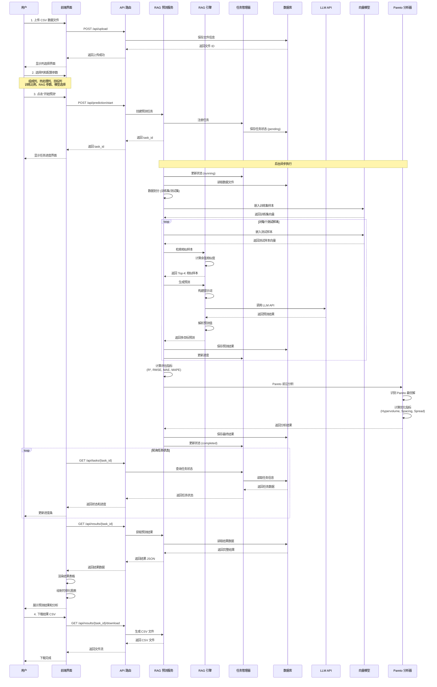

```mermaid  
sequenceDiagram
    participant User as 用户
    participant Frontend as 前端界面
    participant API as API 路由
    participant RAGService as RAG 预测服务
    participant RAGEngine as RAG 引擎
    participant TaskMgr as 任务管理器
    participant DB as 数据库
    participant LLM as LLM API
    participant Embed as 向量模型
    participant Pareto as Pareto 分析器
    
    %% 数据上传阶段
    User->>Frontend: 1. 上传 CSV 数据文件
    Frontend->>API: POST /api/upload
    API->>DB: 保存文件信息
    DB-->>API: 返回文件 ID
    API-->>Frontend: 返回上传成功
    Frontend-->>User: 显示列选择界面
    
    %% 配置阶段
    User->>Frontend: 2. 选择列和配置参数
    Note over User,Frontend: 组成列、热处理列、目标列<br/>训练比例、RAG 参数、模型选择
    
    %% 预测任务创建
    User->>Frontend: 3. 点击"开始预测"
    Frontend->>API: POST /api/prediction/start
    API->>RAGService: 创建预测任务
    RAGService->>TaskMgr: 注册任务
    TaskMgr->>DB: 保存任务状态 (pending)
    RAGService-->>API: 返回 task_id
    API-->>Frontend: 返回 task_id
    Frontend-->>User: 显示任务进度界面
    
    %% 异步预测执行
    Note over RAGService,Pareto: 后台异步执行
    
    RAGService->>TaskMgr: 更新状态 (running)
    RAGService->>DB: 读取数据文件
    RAGService->>RAGService: 数据划分 (训练集/测试集)
    
    %% 向量嵌入
    RAGService->>Embed: 嵌入训练集样本
    Embed-->>RAGService: 返回训练集向量
    
    %% 对每个测试样本进行预测
    loop 对每个测试样本
        RAGService->>Embed: 嵌入测试样本
        Embed-->>RAGService: 返回测试样本向量
        
        RAGService->>RAGEngine: 检索相似样本
        RAGEngine->>RAGEngine: 计算余弦相似度
        RAGEngine-->>RAGService: 返回 Top-K 相似样本
        
        RAGService->>RAGEngine: 生成预测
        RAGEngine->>RAGEngine: 构建提示词
        RAGEngine->>LLM: 调用 LLM API
        LLM-->>RAGEngine: 返回预测结果
        RAGEngine->>RAGEngine: 解析预测值
        RAGEngine-->>RAGService: 返回多目标预测
        
        RAGService->>DB: 保存预测结果
        RAGService->>TaskMgr: 更新进度
    end
    
    %% 评估和分析
    RAGService->>RAGService: 计算评估指标<br/>(R², RMSE, MAE, MAPE)
    RAGService->>Pareto: Pareto 前沿分析
    Pareto->>Pareto: 识别 Pareto 最优解
    Pareto->>Pareto: 计算优化指标<br/>(Hypervolume, Spacing, Spread)
    Pareto-->>RAGService: 返回分析结果
    
    RAGService->>DB: 保存最终结果
    RAGService->>TaskMgr: 更新状态 (completed)
    
    %% 前端轮询获取结果
    loop 轮询任务状态
        Frontend->>API: GET /api/tasks/{task_id}
        API->>TaskMgr: 查询任务状态
        TaskMgr->>DB: 读取任务信息
        DB-->>TaskMgr: 返回任务数据
        TaskMgr-->>API: 返回任务状态
        API-->>Frontend: 返回状态和进度
        Frontend-->>User: 更新进度条
    end
    
    %% 获取最终结果
    Frontend->>API: GET /api/results/{task_id}
    API->>RAGService: 获取预测结果
    RAGService->>DB: 读取结果数据
    DB-->>RAGService: 返回完整结果
    RAGService-->>API: 返回结果 JSON
    API-->>Frontend: 返回结果数据
    
    %% 结果展示
    Frontend->>Frontend: 渲染结果表格
    Frontend->>Frontend: 绘制可视化图表
    Frontend-->>User: 展示预测结果和分析
    
    User->>Frontend: 4. 下载结果 CSV
    Frontend->>API: GET /api/results/{task_id}/download
    API->>RAGService: 生成 CSV 文件
    RAGService-->>API: 返回 CSV 文件
    API-->>Frontend: 返回文件流
    Frontend-->>User: 下载完成
```
